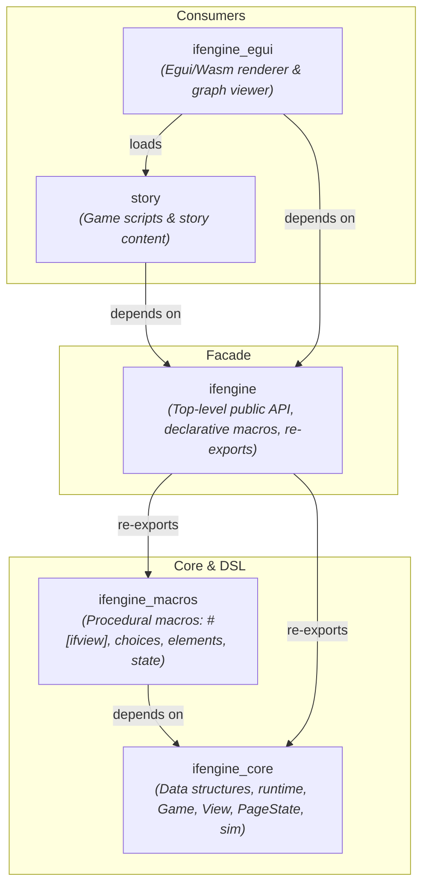
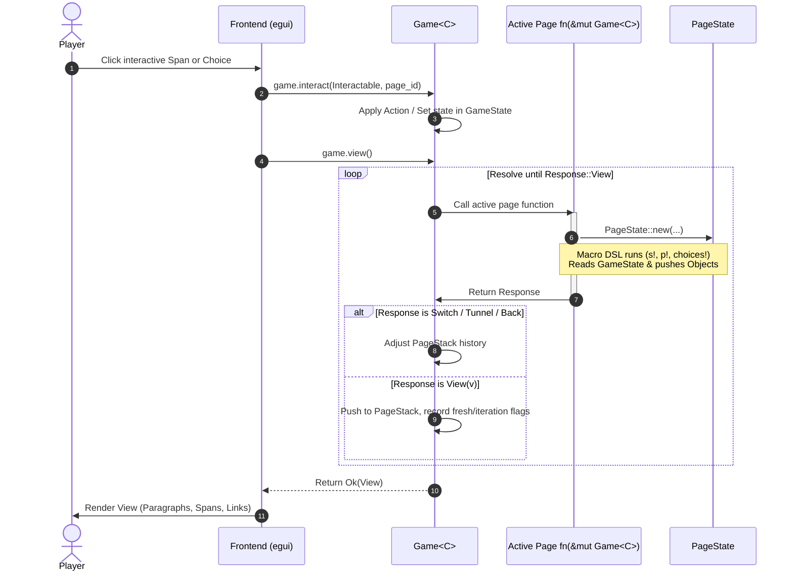
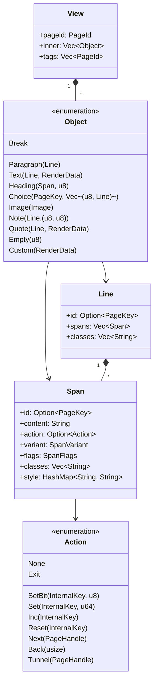
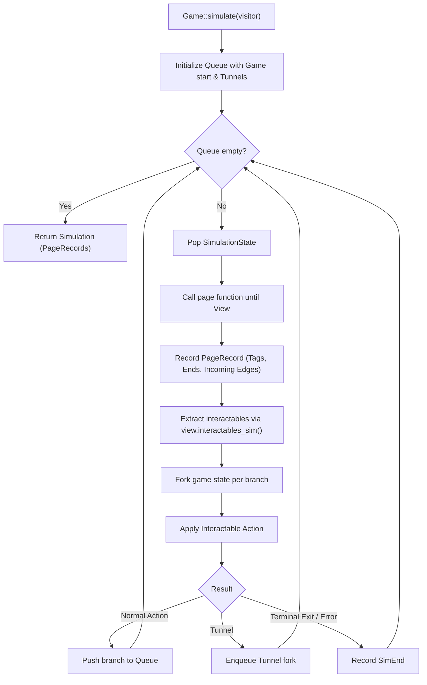

# IFEngine Architecture

`ifengine` is an interactive fiction framework in Rust that blends immediate-mode page execution with deterministic state persistence, an expressive macro DSL, and built-in simulation/analysis tools.

This document describes the architectural layout, crate hierarchy, core execution model, state and key systems, simulation pipeline, and frontend decoupling.

---

## 1. Crate Hierarchy & Dependency Graph

The workspace is organized as a clean Directed Acyclic Graph (DAG) to isolate core engine semantics, procedural macros, high-level facade APIs, and presentation frontends:



### Crate Roles

| Crate | Responsibility |
| :--- | :--- |
| [`ifengine_core`](file:///Users/absinthe/gh/OWN/ifengine/ifengine_core) | Foundation crate containing pure engine data models, history stacks, the [`Game`](file:///Users/absinthe/gh/OWN/ifengine/ifengine_core/src/core/game.rs) object, [`PageState`](file:///Users/absinthe/gh/OWN/ifengine/ifengine_core/src/core/page_state.rs), [`View`](file:///Users/absinthe/gh/OWN/ifengine/ifengine_core/src/view/mod.rs) tree, simulation runner, and declarative navigation macros. Has zero dependencies on proc-macros. |
| [`ifengine_macros`](file:///Users/absinthe/gh/OWN/ifengine/ifengine_macros) | Procedural macro library implementing `#[ifview]`, element builders (`s!`, `l!`, `p!`), choice constructs (`choice!`, `mchoice!`, `dchoice!`), and state operations (`read_key!`, `click!`, `alts!`). Directly depends on `ifengine_core` to resolve documentation links and type bindings without cycles. |
| [`ifengine`](file:///Users/absinthe/gh/OWN/ifengine/ifengine) | Facade crate. Re-exports core types (`Game`, `Action`, `View`, `GameError`, `SimEnd`), the page attribute `#[ifview]`, and groups all interactive macros and elements under [`ifengine::elements`](file:///Users/absinthe/gh/OWN/ifengine/ifengine/src/elements/mod.rs). |
| [`ifengine_egui`](file:///Users/absinthe/gh/OWN/ifengine/egui) | Frontend application using [egui](https://github.com/emilk/egui) that renders `View` objects into immediate-mode GUI components and visualizes story simulation graphs. |

---

## 2. Core Execution Model & Lifecycle

`ifengine` treats pages as functions executed in an immediate-mode loop. When the active page is evaluated, it yields a [`Response`](file:///Users/absinthe/gh/OWN/ifengine/ifengine_core/src/core/page.rs). If the response is a navigation transition, the engine updates its internal page stack and continues evaluation until a [`Response::View`](file:///Users/absinthe/gh/OWN/ifengine/ifengine_core/src/view/mod.rs) is produced.



### Page Responses (`Response`)

- **`Response::View(View)`**: Halts the evaluation loop and presents the rendered DOM-like `View` to the frontend.
- **`Response::Switch(PageHandle)`**: Replaces the current page with the target page (e.g., `NEXT!(target_page)`).
- **`Response::Tunnel(PageHandle)`**: Pushes a new tunnel frame onto the call stack and enters the target page (e.g., `TUN!(sub_routine)`).
- **`Response::Back(n)`**: Pops `n` rendered pages from history.
- **`Response::Exit`**: Pops the current tunnel frame and returns to the calling page stack.
- **`Response::End`**: Terminates the game session (`GameError::End`).

---

## 3. View Tree & Object Hierarchy

A [`View`](file:///Users/absinthe/gh/OWN/ifengine/ifengine_core/src/view/mod.rs) is an immutable representation of the UI to be presented on screen for a single interaction turn.



### Inherent Attributes on Spans and Lines

Every `Span` and `Line` can carry:
- **`id: Option<PageKey>`**: A stable 64-bit key generated deterministically at call sites via `s!` and `l!`.
- **`classes: Vec<String>`**: CSS-like class identifiers set via `.cls("name")` or `.classes(["a", "b"])`.
- **`style: HashMap<String, String>`**: Inline style properties (e.g. `color`, `font-size`) set via `.style("color", "#ff0000")`.
- **`action: Option<Action>`**: The state mutation or navigation event to fire when activated by the player.

---

## 4. State Management: Global Context, GameState, and PageState

`ifengine` partitions state into three complementary layers:

```
┌─────────────────────────────────────────────────────────────┐
│ Game<C>                                                     │
│ ┌─────────────────────────┐  ┌────────────────────────────┐ │
│ │ Context C (User State)  │  │ GameTags                   │ │
│ │ e.g. HP, Inventory,     │  │ Persistent tags tracking   │ │
│ │ Quest Flags             │  │ story milestones           │ │
│ └─────────────────────────┘  └────────────────────────────┘ │
│ ┌─────────────────────────────────────────────────────────┐ │
│ │ GameState (Internal Page Maps)                          │ │
│ │   page_id -> PageMap (PageKey -> u64)                   │ │
│ └─────────────────────────────────────────────────────────┘ │
│ ┌─────────────────────────────────────────────────────────┐ │
│ │ PageStack (History & Tunnels)                           │ │
│ │   Vec<Vec<PageHandle>> (Tunnel frames)                  │ │
│ └─────────────────────────────────────────────────────────┘ │
└─────────────────────────────────────────────────────────────┘
```

1. **User Game Context (`C`)**:
   - Arbitrary user struct passed as `&mut C` to pages decorated with `#[ifview]`.
   - Used for domain-specific game logic (stats, items, dialogue variables).
2. **Global Engine State (`GameState`)**:
   - Holds page-local key-value stores (`PageMap`: `PageKey -> u64`).
   - Persists state for choices, click counters, cycle positions, and bitmasks across renders.
3. **Transient Evaluation Context (`PageState<'a>`)**:
   - Allocated only for the duration of a page function invocation.
   - Accumulates `Object`s into the output `View`.
   - Provides deterministic key generation (`auto_key`) through `call_site_counters`.

---

## 5. PageKey Architecture & Collision Avoidance

Interactive elements (`click!`, `choice!`, `count!`, `alts!`) require persistent state without forcing authors to hand-craft unique IDs.

Keys are formatted as 64-bit integers split into four 16-bit segments:

```text
 63          48 47          32 31          16 15           0
+--------------+--------------+--------------+--------------+
|   Counter    |  File Hash   | Line Number  | Column Number|
|   (16 bits)  |  (16 bits)   |  (16 bits)   |  (16 bits)   |
+--------------+--------------+--------------+--------------+
```

- **User Manual Keys (`Counter == 0`)**:
  - Top 16 bits are `0x0000`, reserving 48 bits (`0x0000_FFFF_FFFF_FFFF`) for user integers (e.g. `read_key!(6)`).
- **Auto Keys (`Counter >= 1`)**:
  - `File Hash`: Compile-time 16-bit FNV-1a hash of `file!()`.
  - `Line / Column`: Compile-time 16-bit coordinates via `#[track_caller]`.
  - `Counter`: Runtime 1-based instance counter tracked in `PageState.call_site_counters`. If the same macro executes multiple times in a loop, each iteration receives a distinct, reproducible key (`Counter = 1, 2, 3, ...`).

---

## 6. Procedural Macro Pipeline (`ifengine_macros`)

All macros expand into standard Rust code interacting with `__ifengine_page_state` and `__ifengine_game`:

| Module | Contents |
| :--- | :--- |
| [`view.rs`](file:///Users/absinthe/gh/OWN/ifengine/ifengine_macros/src/view.rs) | `#[ifview]` attribute (wraps user `fn(&mut C)` into `fn(&mut Game<C>) -> Response`), `img!`, `h!`, `hr!`. |
| [`elements.rs`](file:///Users/absinthe/gh/OWN/ifengine/ifengine_macros/src/elements.rs) | Basic element constructors: `s!`, `l!`, `link!`, `tun!`, `push!`, `text!`, `texts!`, `paragraph!`, `paragraphs!`. Automatically attach call-site keys via `__ifengine_page_state.auto_key()`. |
| [`choices.rs`](file:///Users/absinthe/gh/OWN/ifengine/ifengine_macros/src/choices.rs) | Interactive branching DSL: `choice!`, `mchoice!`, `dynamic_choice!`, `dchoice!`, and inline-delimited `dparagraph!`, `mparagraph!`. |
| [`state.rs`](file:///Users/absinthe/gh/OWN/ifengine/ifengine_macros/src/state.rs) | Direct key read/write/mask operations (`read_key!`, `set_key_mask!`), click handlers (`click!`), cycling spans (`alts!`), and tag management (`tag!`, `untag!`). |
| [`nodes.rs`](file:///Users/absinthe/gh/OWN/ifengine/ifengine_macros/src/nodes.rs) | Common syn parsing AST nodes (`MaybeKey`, `KeyExpr`, `ExprAndOptional`). |

---

## 7. Simulation & Static Story Analysis

`ifengine_core` includes a full-state simulation engine in [`run/sim.rs`](file:///Users/absinthe/gh/OWN/ifengine/ifengine_core/src/run/sim.rs). Authors can test all possible play-through paths without rendering a UI:



### Simulation Capabilities
- **Dead-end & End State Detection**: Identifies terminal states (`SimEnd::TunnelExit`, `SimEnd::Custom`, errors).
- **Reachability & Min-Depth Calculation**: Measures shortest path depths to each story passage.
- **Cycle Bounding via Tunnels**: Grouping subroutines into tunnels guarantees termination while exploring non-trivial loops.
- **Graph Generation**: [`ifengine_egui`](file:///Users/absinthe/gh/OWN/ifengine/egui) converts `Simulation` runs into visual node graphs via `egui-snarl`.

---

## 8. Frontend Interface & Decoupling

The engine is completely decoupled from any specific windowing or UI system. A frontend only needs to:
1. Initialize `Game<C>` with the entry page (`Game!(story::start_page)`).
2. Call `game.view()` to receive a `View`.
3. Render `Object` variants (displaying text, formatting choices, applying styles).
4. On user click, dispatch the corresponding `Interactable` via `game.interact(interactable, &view.pageid)`.
5. Repeat from step 2.
